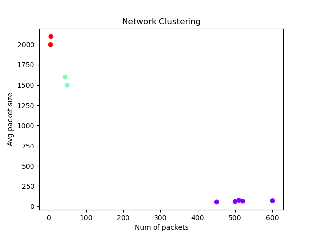

# DBSCAN Clustering



## 🎯 Overview
DBSCAN (Density-Based Spatial Clustering of Applications with Noise) groups points that are closely packed together, marking as outliers those in low-density regions.  
👉 Great for clusters of arbitrary shape and noise detection.

## 🛠️ Files
- `dbscan.py`: Python script demonstrating DBSCAN on a synthetic dataset.  
- `DBscan.png`: Resulting cluster plot.

## 🚀 Run
```bash
python dbscan.py
```
