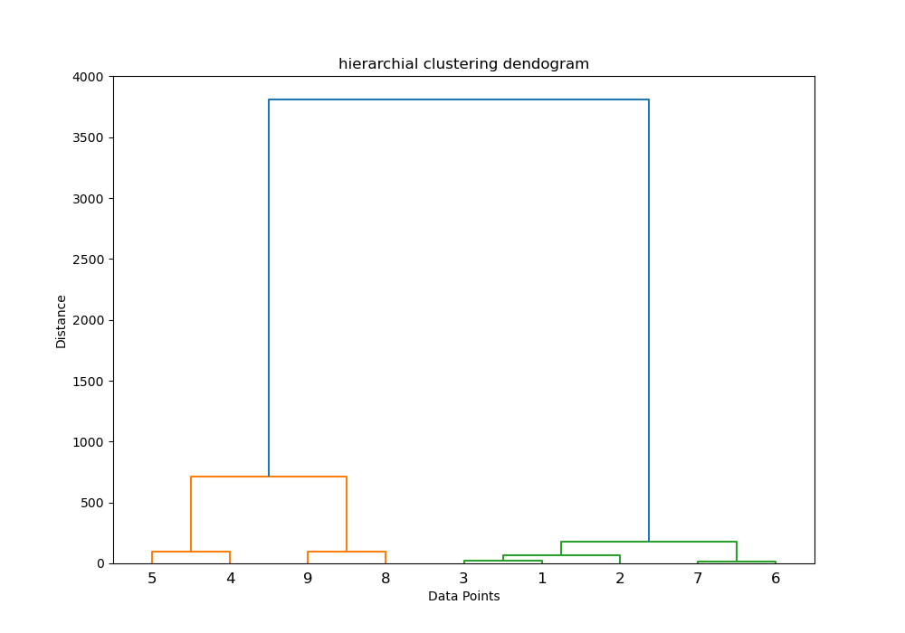

# Hierarchical Clustering



## 🎯 Overview
Hierarchical clustering builds nested clusters by merging or splitting them successively.  
👉 Use dendrograms to visualize cluster hierarchy.

## 🛠️ Files
- `h_clustering.py`: Python script demonstrating agglomerative clustering on a dataset.  
- `Hierarchial.png`: Sample dendrogram.

## 🚀 Run
```bash
python h_clustering.py
```
