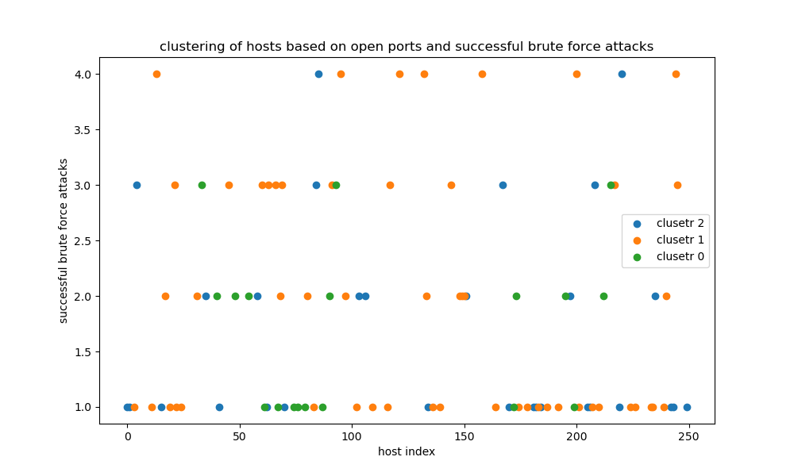

# Vulnerability Analysis (Anomaly Detection)



## 🎯 Overview
This demo applies unsupervised techniques to detect anomalies in system logs/data.  
👉 Identify outlier points indicating potential vulnerabilities.

## 🛠️ Files
- `VulAnalysis.py`: Python script for anomaly detection.  
- `MLDATA.csv`: Sample dataset.  
- `Vul_Analysis.png`: Plot of detected anomalies.

## 🚀 Run
```bash
python VulAnalysis.py
```
